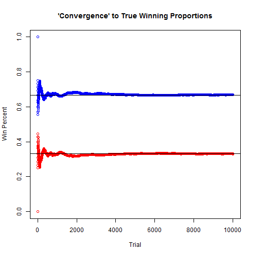

# Monty Hall Problem Simulation

The Monty Hall problem is a brain teaser, loosely based around the tv show 'Let's Make A Deal' and named after its host Monty Hall. It became quite famous after it was asked in a column in Parade magazine in 1990. The basic premise is this:

You are a contestant on some tv show. There are three doors to choose from, where one door contains the prize and the other two doors contain goats behind them (let's assume goats are not considered a prize to you, but they may be to some people...). After you give your initial pick, the host reveals a goat behind one of the other doors. At this point, the host asks if you'd like to switch doors (to the other non-revealed door). What do you do?

Well, interestingly enough, there is a correct answer. You should switch doors. If you don't see why immediately, don't feel bad. This question stumped some famous mathematicians and statisticians, hence why the problem became famous. The reasoning follows from probability theory, in particular, Bayes' theorem.

What this tells you is that your probability of winning the prize changes (from 1/3 before the door reveal) to 2/3 if you choose to switch doors afer the reveal. If you don't switch, your chance of winning remains at 1/3. Wikipedia has a pretty good explanation of the theory behind it: https://en.wikipedia.org/wiki/Monty_Hall_problem

Here, we perform a simulation of the experiment in R. Let's do 10,000 simulations of the experiment. This first chunk of code generates the samples in the experiment. It is pretty self-explanatory from the comments in the code.


```r
## Number of simulations
N <- 10000

## Setting the seed (not necessary)
set.seed(7)

## Randomly select the doors which have the prize behind it
prize <- sample(1:3, N, replace = TRUE)

## Randomly select the contestant's door choice
stay <- sample(1:3, N, replace = TRUE)


reveal <- rep(0, N)
change <- rep(0, N)

for(i in 1:N) {
  x <- c(1:3)[-c(prize[i], stay[i])]

  ## If contestant chose wrong door, then only one possible door to reveal
  ## If contestant already chose the correct door, then two possible doors to reveal
  ## If so, choose randomly which door to reveal
  reveal[i] <- x[sample.int(length(x), size = 1)]

  ## This changes from the original choice to the other door not revealed
  change[i] <- c(1:3)[-c(reveal[i], stay[i])]
}

## Number of wins for changing or staying with initial door respectively
changewin <- ifelse(change == prize, 1, 0)
staywin <- ifelse(stay == prize, 1, 0)

## Proportion of wins
change_perc <- mean(changewin)
stay_perc <- mean(staywin)

## To display the results nicely
d1 <- "\n Monty Hall Problem Simulation\n\n\"Don't Switch\"\n"
d2 <- "\n                           Wins = "
d3 <- "\n               Number of Trials = "
d4 <- "\n    Observed Winning Proportion = "
d5 <- "\n Theoretical Winning Proportion = "
d6 <- "\n\n\"Switch to Other Door\"\n"
```

The code below displays the results of the 10,000 simulations in a nice format. Here we see by not switching, you only win 3,307 times, which amounts to roughly 33%. By switching, your winning totals jump to 6693, or roughly 67%.


```r
cat(d1, d2, sum(staywin), d3, N, d4, stay_perc, d5, 1/3, d6,
    d2, sum(changewin), d3, N, d4, change_perc, d5, 2/3)
```

```
## 
##  Monty Hall Problem Simulation
## 
## "Don't Switch"
##  
##                            Wins =  3307 
##                Number of Trials =  10000 
##     Observed Winning Proportion =  0.3307 
##  Theoretical Winning Proportion =  0.3333333 
## 
## "Switch to Other Door"
##  
##                            Wins =  6693 
##                Number of Trials =  10000 
##     Observed Winning Proportion =  0.6693 
##  Theoretical Winning Proportion =  0.6666667
```

The following code plots 'convergence' to the true winning proportions for switching (in blue) and for not switching doors (in red). After about 2,000 simulations, it is pretty close to the theoretical proportion.


```r
## Plot 'convergence' to true winning proportions
## Blue is switching doors, red is staying
plot.new()
plot(cumsum(changewin) / c(1:N), main = "'Convergence' to True Winning Proportions",
     xlab = "Trial", ylab = "Win Percent", ylim = c(0, 1), col = "blue")
abline(h = 2/3)
points(cumsum(staywin) / c(1:N), type = "p", col = "red")
abline(h = 1/3)
```


